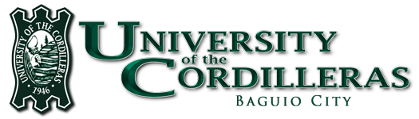

<div align="center">



# UC Resources Hub

**A central academic resource hub for the University of the Cordilleras**

*Empowering Your Academic Journey*

[](https://developer.mozilla.org/en-US/docs/Web/HTML)
[](https://developer.mozilla.org/en-US/docs/Web/CSS)
[](https://getbootstrap.com/)
[](https://fonts.google.com/)

</div>

---

## 📖 Overview

UC Resources Hub is a responsive, single-page web application that aggregates academic resources across UC's colleges and departments. It features a clean, branded interface with smooth animations and direct links to the university's library databases and open educational resources.

---

## ✨ Features

- 🏠 **Hero Section** — Full-screen banner with animated intro text and call-to-action
- 📚 **Featured Resources** — Quick access to Libraries, Free Online Resources, and OERs
- 🎓 **College Categories** — Per-college resource and course links with cover images
- 📰 **Sample Resources** — Curated journals and open-access databases
- 📬 **Contact Form** — Reach out directly via the About section
- 📱 **Fully Responsive** — Mobile-friendly layout powered by Bootstrap 5

---

## 🛠️ Tech Stack

| Technology | Purpose |
|---|---|
|  | Page structure and content |
|  | Custom styles and animations |
|  | Responsive grid and components |
|  | Fjalla One typeface |

---

## 📁 Project Structure

```
uc-resources-hub/
├── 📄 index.html           # Main application page
├── 🎨 index.css            # Custom styles and animations
├── ⚙️  appBuilding2.json   # App configuration (hosted URL)
└── 🖼️  images/
    ├── uc_logo_green_ext_h150.png   # UC logo
    ├── uc-web-bg.jpg                # Hero background
    ├── ali-icon.png                 # Favicon
    └── image-1.png ... image-6.png  # College category images
```

---

## 🚀 Getting Started

No build tools required. Open `index.html` directly in a browser, or serve it locally:

```bash
# Using Python
python -m http.server 8080

# Using Node.js
npx serve .
```

Then visit `http://localhost:8080`

---

## 🗂️ Sections

| # | Section | Description |
|---|---|---|
| 1 | 🏠 Home | Hero banner with animated intro and CTA |
| 2 | ⭐ Featured Resources | Quick links to UC library portals |
| 3 | 🎓 Categories | Per-college resource and course links |
| 4 | 📰 Sample Resources | Curated journals and open-access databases |
| 5 | 📬 About | Mission statement and contact form |

---

## 🎓 Covered Colleges

| College | Resources |
|---|---|
| 📊 Accountancy | Finance, auditing, and accounting materials |
| 🔬 Arts & Sciences | Humanities, social & natural sciences |
| 🍎 Teacher Education | Teaching strategies and professional development |
| 🏥 Nursing | Patient care, medical knowledge, clinical practice |
| 💻 Information Technology | Programming, networks, and digital innovation |
| ⚙️ Engineering | Design, problem-solving, and applied technical skills |

---

## 👤 Credits

Developed by **Mohammad Ali Dimacaling**
© 2026 All rights reserved.

🏫 University of the Cordilleras — Baguio City, Philippines
🌐 [uc-bcf.edu.ph](https://www.uc-bcf.edu.ph)
